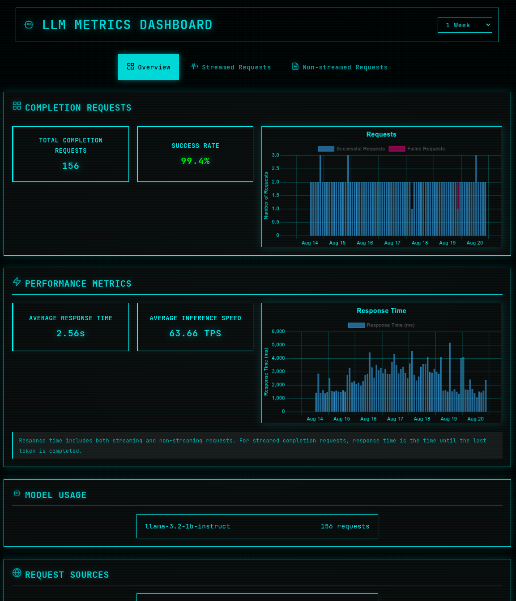

# LLM Metrics Proxy

A secure, production-ready reverse proxy that monitors OpenAI-compatible API requests and provides comprehensive metrics and analytics. This system enables you to track usage, monitor performance, and gain insights into your LLM API deployments while maintaining security and separation of concerns.

**Note**: This proxy tracks and monitors requests following the [OpenAI API specification](https://platform.openai.com/docs/api-reference/chat), but it is not made by OpenAI. It's designed to work with any OpenAI-spec compliant backend service.



## 🎯 Purpose

The LLM Metrics Proxy solves a critical need for organizations deploying LLM services: **visibility and monitoring**. Whether you're running Ollama, vLLM, LocalAI, or any other OpenAI-compatible backend, this proxy gives you enterprise-grade monitoring capabilities without compromising security.

## ✨ Key Features

- **🔒 Secure by Design**: Proxy server can be safely exposed to the internet while keeping metrics internal
- **📊 Real-time Metrics**: Track request success rates, response times, and usage patterns with date filtering
- **🌐 Universal Compatibility**: Works with any OpenAI-spec compliant service (Ollama, vLLM, LocalAI, etc.)
- **📱 Beautiful Dashboard**: Modern React frontend with timeframe selector and theming system
- **🐳 Docker Ready**: Simple deployment with Docker Compose
- **💾 Lightweight Storage**: SQLite-based metrics storage with minimal overhead
- **🔌 API-First**: RESTful metrics API with completion requests endpoint for detailed analysis
- **⚡ High Performance**: Minimal latency overhead for your LLM requests
- **📅 Time-based Filtering**: Filter metrics and requests by time periods (1h, 6h, 12h, 1d, 1w, 1mo, All)

## 📊 Metrics Coverage

### Non-Streaming Requests
- **Complete Metrics**: Token usage, response times, success rates
- **Token Analysis**: Prompt tokens, completion tokens, total tokens
- **Performance**: Tokens per second, response time analysis

### Streaming Requests  
- **Timing Metrics**: Time to first token, total response time
- **Success Tracking**: Request success/failure rates
- **Token Usage**: Automatically enabled via `include_usage` option when available
- **Smart Parsing**: Captures usage statistics from final streaming chunk

## 🚀 Quick Start

Get up and running in minutes:

```bash
# Clone and start all services
git clone <repository>
cd llm-metrics-proxy
docker-compose up -d

# Access your services:
# OpenAI API: http://localhost:8001
# Dashboard: http://localhost:3000
# Metrics API: http://localhost:8002
```

## 📚 Documentation

- **[Technical Documentation](docs/technical/)** - Architecture, API reference, and deployment guides
- **[AI Context Documentation](docs/ai-context/)** - For AI assistants and developers
- **[Examples](EXAMPLES.md)** - Deployment examples and configurations

### For Developers
- **[Frontend Architecture](docs/technical/frontend-architecture.md)** - React, SCSS, and theming system details
- **[API Reference](docs/technical/api.md)** - Complete API documentation
- **[Development Guide](docs/technical/development.md)** - Local setup and development workflow

## 🔄 Streaming with Usage

The proxy can capture token usage from streaming responses when clients enable it:

### Client-Controlled Usage
- **Respects Client Choice**: Only captures usage when client sets `include_usage: true`
- **Smart Parsing**: Captures usage statistics from the final streaming chunk when available
- **Fallback Handling**: Gracefully handles cases where usage data isn't available
- **No Request Modification**: Never modifies client requests

## 📊 API Design Principles

### Raw Data Focus
- **No Calculated Fields**: API provides raw counts and measurements
- **Frontend Calculations**: Percentages and ratios calculated on the client side
- **Efficient Data Transfer**: Only essential data sent over the network
- **Flexible Display**: Frontend can format and calculate metrics as needed

### Example Request (with usage enabled)
```json
{
  "model": "llama3.1:8b",
  "messages": [{"role": "user", "content": "Hello"}],
  "stream": true,
  "stream_options": {
    "include_usage": true
  }
}
```

### Example Request (without usage)
```json
{
  "model": "llama3.1:8b",
  "messages": [{"role": "user", "content": "Hello"}],
  "stream": true
}
```

### Usage Chunk Format
The final chunk before `data: [DONE]` contains:
```json
{
  "choices": [],
  "usage": {
    "prompt_tokens": 17,
    "completion_tokens": 10,
    "total_tokens": 27
  }
}
```

## 🏗️ Architecture

The system is split into three separate services for security and separation of concerns:

```