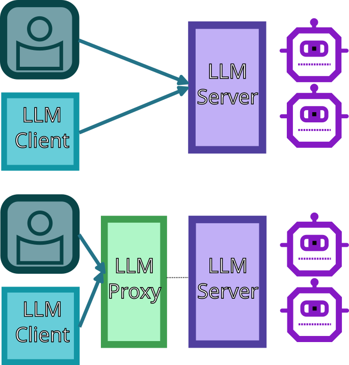

# LLM Metrics Proxy

A secure, production-ready reverse proxy that monitors OpenAI-compatible API requests and provides comprehensive metrics and analytics. This system enables you to track usage, monitor performance, and gain insights into your LLM API deployments while maintaining security and separation of concerns.

**Note**: This proxy tracks and monitors requests following the [OpenAI API specification](https://platform.openai.com/docs/api-reference/chat), but it is not made by OpenAI. It's designed to work with any OpenAI-spec compliant backend service.

<picture>
  <source media="(min-width: 800px)" srcset="docs/README-top.png">
  <source media="(min-width: 600px)" srcset="docs/README-top.png">
  
</picture>
<p align="center"><em>Example of the bundled frontend dashboard using the "Terminal" theme.</em></p>

## 🎯 Purpose

The LLM Metrics Proxy solves a need for those deploying LLM services and desire basic **visibility and monitoring**. Whether you're running Ollama, vLLM, LocalAI, or any other OpenAI-compatible backend, this proxy gives you a look into how users are interacting LLMs, and how these LLMs are performing.

## ⚙️ How does it work

By inserting this proxy in front of your LLM Inference Server (eg. Ollama or vLLM) that supports OpenAI API spec, any completion requests going through the proxy will have their performance recorded (see [Metrics Coverage](#-metrics-coverage)).

If you were calling the LLM Inference Server directly before, you should now call the proxy endpoint to benefit. See [Quick Start](#-quick-start) or [Examples](/EXAMPLES.md) for getting started.

<picture>
  <source media="(min-width: 600px)" srcset="docs/README-arch.png">
  <source media="(min-width: 400px)" srcset="docs/README-arch.png">
  
</picture>

## 📊 Accessing Metrics

The system includes a **metrics server** that serves metrics via an HTTP API (default port 8002). This API provides comprehensive analytics data including request counts, response times, token usage, and performance metrics. You can access this data programmatically or integrate it with your existing monitoring systems.

**API Documentation:** [Complete API Schema](docs/technical/api-spec.md)

### Metrics APIs
- **Real-time Data**: Access current metrics and historical data
- **Date Filtering**: Query metrics for specific time periods
- **Comprehensive Coverage**: Both streaming and non-streaming request metrics
- **Performance Analytics**: Response times, token throughput, and error tracking

### Optional Frontend Dashboard

There's also an optional **frontend dashboard** (default port 3000) that consumes the metrics API to provide a visual interface for monitoring your LLM deployments. The dashboard includes:

- **Real-time Metrics**: Live updates of system performance
- **Interactive Charts**: Visual representation of request patterns and trends
- **Multiple Themes**: Choose from various visual themes including a terminal-style interface
- **Responsive Design**: Works on desktop and mobile devices


## 📊 Recorded Metrics

The following details what is taken from therequest/response to create metrics.

### Non-Streaming Requests
- **Request Metadata**: Timestamp, model used, origin/source, success status
- **Timing Data**: Total response time (request start to completion)
- **Token Usage**: Prompt tokens, completion tokens, total tokens
- **Performance Metrics**: Tokens per second calculated from total tokens and response time

### Streaming Requests  
- **Request Metadata**: Timestamp, model used, origin/source, success status
- **Timing Data**: Time to first token, time to last token, total response time
- **Token Usage**: Only available when clients set `stream_options: {"include_usage": true}`
- **Stream Analysis**: Captures usage statistics from the final streaming chunk response

## 🚀 Quick Start

Get up and running in minutes:

```bash
# Clone and start all services (including ollama)
git clone git@github.com:rewolf/llm-metrics-proxy.git
cd llm-metrics-proxy
docker-compose up -d

# Access your services:
# OpenAI API: http://localhost:8001
# Dashboard: http://localhost:3000
# Metrics API: http://localhost:8002

# interact with ollama like: docker exec ollama ollama list
```

*Find an example for your use-case in [EXAMPLES](/EXAMPLES.md).*

## 📚 Documentation

- **[Technical Documentation](docs/technical/)** - Architecture, API reference, and deployment guides
- **[Examples](EXAMPLES.md)** - Deployment examples and configurations

### For Developers
- **[Frontend Architecture](docs/technical/frontend-architecture.md)** - React, SCSS, and theming system details
- **[API Reference](docs/technical/api-spec.md)** - Complete API documentation and detailed schemas
- **[Development Guide](docs/technical/development.md)** - Local setup and development workflow


